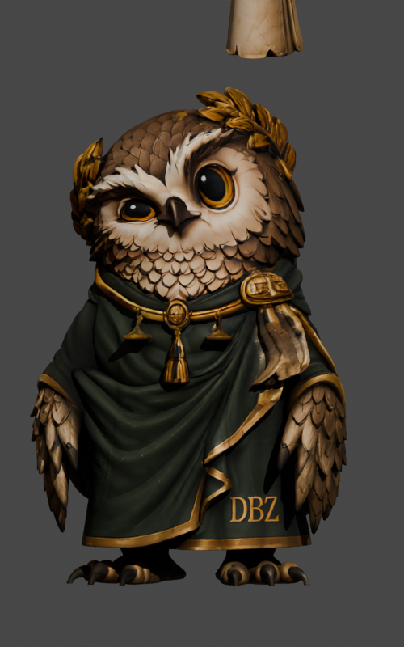
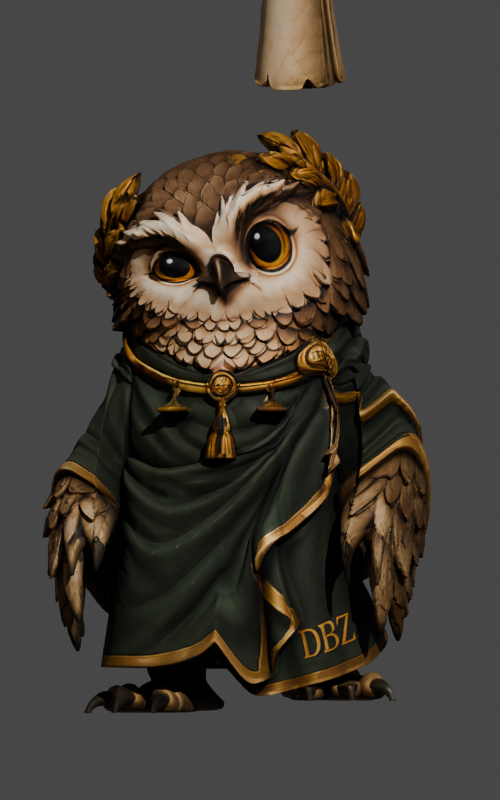
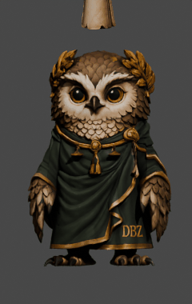
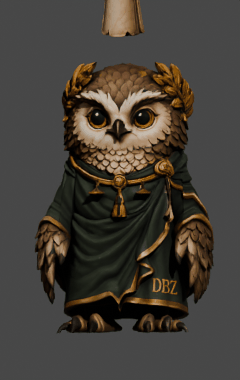
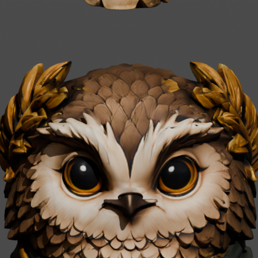
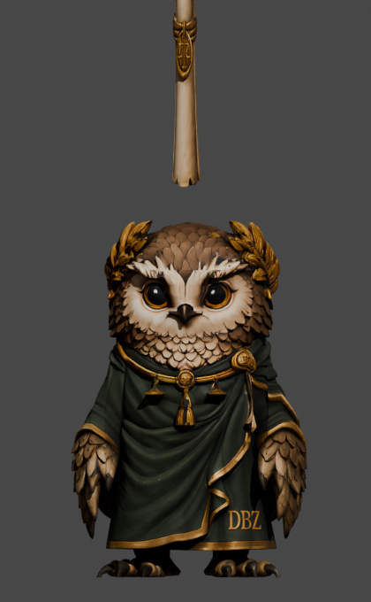
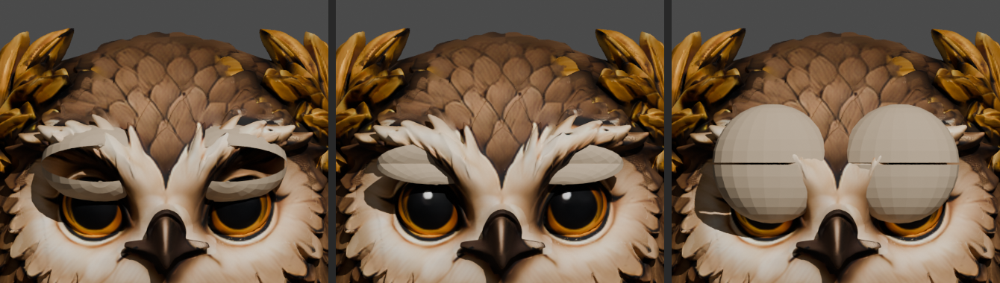
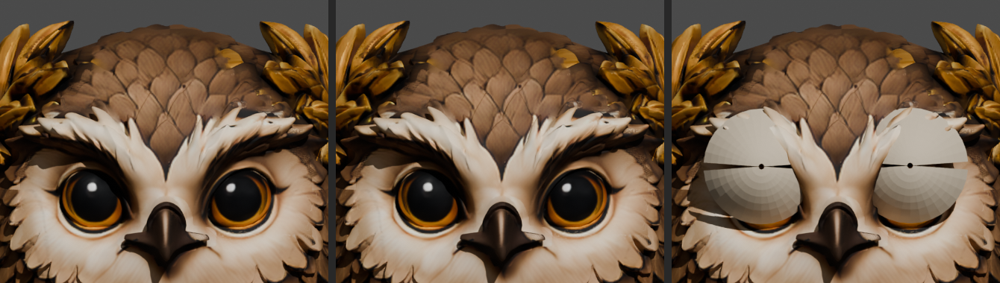
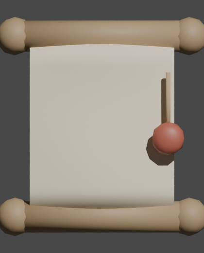
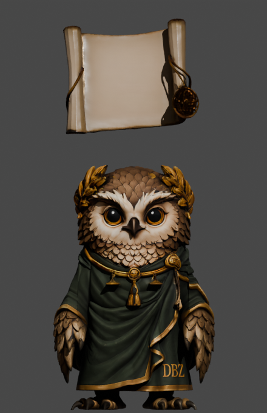

# Thalia, mascote 3D do DBZ para Blender

Coruja mascote do escritorio, com robe e pergaminho. Disponivel como modelo estatico e com **rig** (esqueleto para animar).

## Como abrir

Baixe na aba **Releases**:

- **v1.1 (com rig)** — recomendado para animar:
  - `Cinza_rigged.blend`: abre direto no Blender (File > Open). Malha, material, texturas empacotadas e a armadura `CinzaRig`.
  - `Cinza_rigged.glb`: glTF 2.0 com skin (15 joints). Importe por File > Import > glTF 2.0.
- **v1.0 (sem rig)**: `Cinza.blend` e `Cinza.glb`, so o modelo.

## Rig (esqueleto)

Armadura `CinzaRig`, 15 ossos, pronta em Pose Mode:

| Osso | Controla |
|---|---|
| root | raiz geral |
| pelvis, spine, chest | tronco (inclinar, curvar) |
| neck, head | pescoco e cabeca (virar, inclinar) |
| arm.L / arm.R | asas / bracos laterais |
| thigh.L/R, shin.L/R | pernas sob o robe |
| scroll | pergaminho flutuante |

Pesos atribuidos por regiao (skinning procedural), validados no Blender: cada osso deforma sua area sem rasgar a malha. Modelo sem animacao pronta; o esqueleto e a base para criar as poses e keyframes.

## Texturas

Material unico `pbr_material` (PBR Metallic-Roughness), duas texturas 4096x4096: Base Color (sRGB) e Metallic-Roughness (Non-Color, Verde=Roughness, Azul=Metallic). Ja embutidas nos arquivos.

## v1.2, rig com IK (bracos e pernas)

Baixe `Cinza_rig_IK.blend` na Release v1.2. Abra, selecione a armadura `CinzaRigIK`, entre em **Pose Mode** e anime pelos controladores:

| Controlador | Funcao |
|---|---|
| hand_ik.L / hand_ik.R | alvo IK das asas/bracos (mova para posicionar a mao) |
| elbow_pole.L / .R | direcao do cotovelo |
| foot_ik.L / foot_ik.R | alvo IK dos pes (mova para o passo) |
| knee_pole.L / .R | direcao do joelho |
| torso | controle geral do tronco (COG) |
| head_ctrl | rotacao da cabeca |
| scroll | pergaminho |

As cadeias de braco e perna resolvem por IK (2 ossos), com pole targets para cotovelo e joelho. Skinning por regiao validado no Blender.

Observacao tecnica: o gerador nativo do Rigify nao executa neste ambiente automatizado (a classe de parametros do Rigify nao registra em modo headless nesta build). O rig IK acima foi montado manualmente para entregar o mesmo resultado pratico: controladores de IK para bracos e pernas.

### Pergaminho como objeto separado (v1.2)

No `Cinza_rig_IK.blend` o modelo esta dividido em dois objetos individuais:
- **Cinza**: a coruja (corpo, robe).
- **Pergaminho**: o pergaminho, objeto proprio, selecionavel e editavel a parte. Segue o osso `scroll` (armature), entao continua animavel, mas e um objeto independente.

## v1.3, animacoes (movement sets)

Seguindo as movement sheets planejadas. Baixe na Release v1.3:
- `Cinza_animado.blend`: 7 acoes prontas (Action Editor / NLA).
- `Cinza_animado.glb`: as 7 animacoes como clipes glTF (abrem em qualquer visualizador glTF).

| Clipe | Movimento |
|---|---|
| 01_Idle_Respiracao | parada com respiracao e leve balanco da cabeca (loop) |
| 02_Caminhada | ciclo de caminhada com passos, balanco de tronco e asas (loop) |
| 03_Giro | mudanca de direcao, giro do corpo com antecipacao |
| 04_Gesto_Apresentar | abre a asa apresentando, cabeca acompanha |
| 04b_Gesto_Saudacao | leve reverencia institucional |
| 05_Voo | batida de asas e subida (loop) |
| 06_Pergaminho_Ler | traz o pergaminho a frente e le |

 

Nao incluidos: **05 Expressoes/Olhos/Piscada** e **06 Visemas PTBR** (fala). Sao animacoes faciais e exigem rig de face ou shape keys, que este modelo (malha unica, olhos na textura) nao possui. Para faze-las e preciso um rig facial (o pacote `Rig_Corporal_Facial` da pasta de origem, ou criar shape keys de olhos/bico).

## v2.0, rig refinado, facial e pergaminho independente

Baixe na Release **v2.0**: `Thalia_rig.blend` e `Thalia_rig.glb`.

Duas armaduras separadas, sem qualquer vinculo entre si:
- **ThaliaBodyRig**: corpo (IK de bracos e pernas) + face.
- **ThaliaScrollRig**: so o pergaminho (`scroll_root` + `scroll_ctrl`). Mover o corpo nao afeta o pergaminho e vice-versa.

Rig facial (no ThaliaBodyRig):

| Osso | Funcao |
|---|---|
| beak_lo | maxilar/bico inferior, abre a boca (base para visemas/fala) |
| brow.L / brow.R | sobrancelhas (surpresa, seriedade) |
| lid.L / lid.R | palpebras/area dos olhos (piscada e olhar aproximados) |
| face_ctrl | controle de referencia da face |

Observacao: os olhos e o bico vem da textura (malha unica), entao piscada, olhar e visemas sao obtidos por deformacao da malha ao redor, com resultado sutil. Para fala e piscada de alta fidelidade, o proximo passo e adicionar **shape keys** (bico aberto/fechado por fonema, palpebra fechada), que dao controle limpo alem dos ossos. Posso adicionar se desejado.

## v3.0, shape keys e pergaminho aberto/fechado

Release **v3.0**: `Thalia_rig_v3.blend` e `Thalia_rig_v3.glb` (as shape keys viram morph targets no glTF).

### Coruja, 23 shape keys (Object Data Properties > Shape Keys)

Faciais:
- `Blink_L`, `Blink_R`: piscada.
- `Beak_Open`: abre o bico.
- `Viseme_AA`, `Viseme_OO`, `Viseme_EE`: visemas base para fala.
- `Brow_Up_L/R`, `Brow_Down_L/R`: sobrancelhas.
- `Cheek_Smile`: bochechas.

Membros, maos e dedos:
- `Wing_Spread_L/R`, `Wing_Fold_L/R`: abrir e recolher a asa.
- `Hand_Grasp_L/R`: fechar a "mao" (ponta da asa).
- `Fingers_Spread_L/R`: abrir os "dedos"/penas primarias.
- `Toe_Spread_L/R`, `Toe_Curl_L/R`: dedos e garras do pe.

Cada shape key vai de 0 a 1 e pode ser combinada e animada por keyframes ou drivers.

### Pergaminho, fechado e aberto
- Shape keys `Fechado` (base) e `Aberto` (desenrola: afina o rolo e alonga).
- Rig de curvatura proprio: `scroll_root`, `scroll_mid`, `scroll_tip` (na armadura independente `ThaliaScrollRig`), para curvar e animar o pergaminho.

Nota de fidelidade: como olhos e bico vem da textura, as shape keys faciais deformam a malha ao redor (efeito bom para bico/visema e sobrancelha, mais sutil para piscada). O "Aberto" do pergaminho e uma abertura aproximada por nao existir uma folha plana modelada; da o gesto de desenrolar.

## v3.1, palpebras modeladas (piscada real)

Novo objeto **Palpebras** (calotas superior e inferior por olho), material periocular, segue a cabeca. Piscada por shape keys `Blink_L` e `Blink_R` (0 a 1). Abertas, as palpebras ficam recuadas atras das penas (nao aparecem); fechadas, cobrem os olhos. Ha o objeto separado, entao nao interfere nas 23 shape keys da coruja.

As shape keys `Blink_L/R` que ja existiam na malha da coruja continuam para o vinco ao redor; a cobertura efetiva do olho agora vem da geometria de palpebra.

## v3.2, piscada corrigida e folha do pergaminho

**Correcao da piscada** (a versao anterior deixava as palpebras como bolas salientes): remodeladas como calotas rasas, centradas na iris real (x=+-0.078, z=0.25), curvatura seguindo o olho. Abertas, recuam para dentro da cabeca e ficam invisiveis (estilo membrana nictitante, que corujas tem); fechadas, cobrem os olhos. Shape keys `Blink_L/R` no objeto `Palpebras`.

**Folha do pergaminho** (`Pergaminho_Folha`): geometria da folha aberta seguindo a sheet de referencia, painel plano com roletes de madeira em cima e embaixo, ponteiras, cordao e selo de cera. Objeto proprio, posicionado a frente do rolo (o rolo fechado `Pergaminho` continua no projeto).

Verificacao das demais modelagens: shape keys faciais (bico/visemas/sobrancelhas) e de membros/maos/dedos conferidas, sem quebras.

## v3.3, pergaminho pelo modelo 3D real

Verificacao do conteudo atualizado da pasta de referencia: o arquivo `Hitem3d-*.glb` enviado e uma **reconstrucao 3D da folha de referencia inteira**, ou seja, a grade com as 24 poses do pergaminho, cada uma como geometria solta (nao e um pergaminho unico pronto).

Extrai desse modelo a melhor instancia de **pergaminho aberto** (painel de papel texturizado, com roletes enrolados, cordao e selo de cera), limpei, recentrei e integrei ao projeto como `Pergaminho_Folha`, substituindo a folha que eu havia modelado a mao. Fica posicionada acima da coruja; o rolo fechado `Pergaminho` permanece no projeto.

